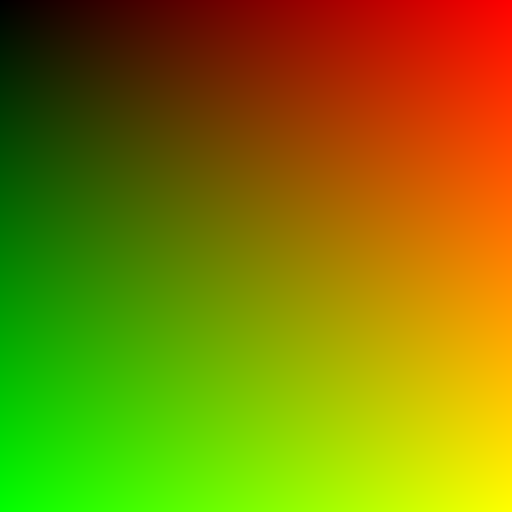

# carbuncle [](https://brainmade.org/)
Just another raytracer

# Background
I'm learning the Ruby programming language beyond building Rails apps to get better at syntax, standard library, and so
on. I'm deliberately withholding the use of AI in this project since the purpose is to learn at a deeper level.

# Usage
A demo scene is rendered (48-bit RGB colors, default resolution 512x512) in the PPM format to `stdout`, you will have to pipe it to a file name of
your choosing.

```bash
ruby carbuncle.rb > image.ppm
```

# Progress
## Hello World

